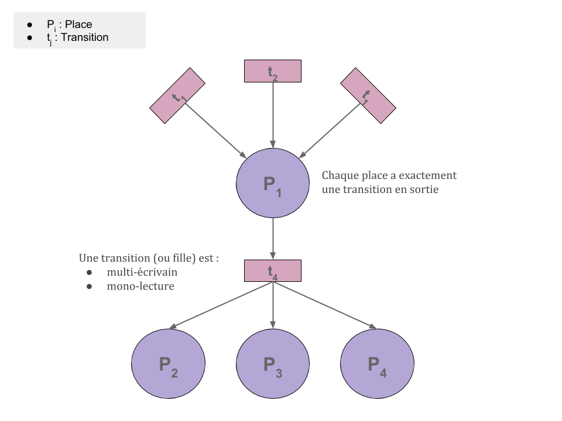
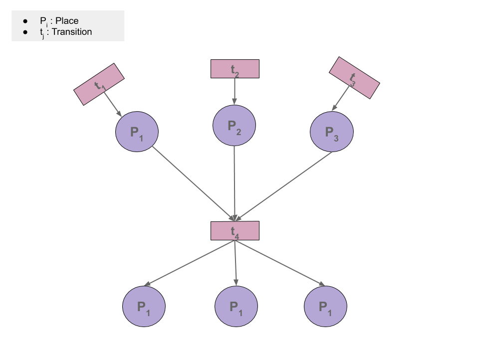

# Creation of a random Free-choice generator

A ramdon generator of living Free-choice

# Sommaire
- [Project description](#ProjetcDescription)
- [Compile sources](#Compile)
- [Link static library](#Library)
- [Script](#MainScript)
	- [Requires](#RequiresMain)
	- [Description](#DescriptionFunctionsMain)
	- [Exampe of use](#MainExample)
- [API](#Api)
	- [Generate Free-choice](#FreeChoiceApi)
	- [Petri Structure](#PetriStructure)
		- [Definition](#PetriStructDef)
		- [Example](#PetriStructExample)
- [Simple Python interface](#Interface)
  - [Requires](#Requires)
  - [Commands](#Commands)
  - [Example](#ExamplePy)

# Project description <a name="ProjetcDescription"/>

A free choice graph is a subclass of petri net where each place has exactly one output and transitions have one input and multiple outputs as shown in the following figure



The generator convert a living and normalized SDF to a Free-choice. That transformation is apply on each transition in the SDF that have more than 1 input as shown below.



Then the process gather all the places to have a unique input into the transition.
To achieve that goal the SDF is generated from a strongly conected graph where a node is converted into a transition and an edge into a place. To ensure that there is enough transitions with multiple inputs (thus, for the directed graph that implies to have multiple inputs per node) user have to select the number of desired input for the strongly connected graph (and can also select the number of outputs which need to be at least equal to the number of input to ensure that there no transition (no node in the graph) without any input.

# Compile sources <a name="Compile"/>

Execute the Makefile inside *Algorithme_C*. That produces two executables *freeChoiceGenerator* (the generator itself) and *main_py* the script used by Python for the graphical interface. The Python graphical interface scripts are saved under *Python*.

# Link library <a name="Library"/>
The needed library, *FreeChoiceGeneratorLib.a*, is saved into *Library* with the header file named *freeChoiceGenerator.h*. To link that library to another program :

```gcc -o example example.c -lm -lglpk /pathToMakeFileFolder/Library/FreeChoiceGeneratorLib.a -I/pathToMakeFileFolder/Library```

# Script <a name="MainScript"/>

## Requires <a name="RequiresMain"/>
    - libglpk-dev (version 4.61-1)
    - gcc (version 4:6.3.0-4)
    
## Description <a name="DescriptionFunctionsMain"/>

*NAME*

freeChoiceGenerator - a random generator of living Free-choice

SYNOPSIS

```freeChoiceGenerator [nb_transition] [nb_input_node] [vect_norm] -OPTIONS```

*DESCRIPTION*

freeChoiceGenerator allows user to generate random living Free-choice network given the desired number of transitions ```[nb_transition]``` in the final petri network. 

The generation of the final network is based uppon the one of a strongly connected graph where the number of input ```[nb_input_node]``` and output ```[nb_output_node]``` per node is set by the user (with the following constraint ```[nb_input_node]>=[nb_output_node]```). By default ```[nb_input_node]=[nb_output_node]```.

The ```[vect_norm]``` is the desired norm of the repetition vector to get during the generation of a random one for the SDF

*OPTIONS*

**-o** ```[nb_output_node]```  : set ```[nb_output_node]```

**-c**  : resize the petri net after the transformation from SDF to Free-choice (can be time consuming)

**-f**  : ```[filename]```   save the Free-choice to a file to ```[filename]``` as PNML format

**-s**  : ```[stack_size]```   set the new stack size to use

**-h**  : get help

## Example <a name="MainExample"/>
```freeChoiceGenerator 10 5 20 -f output.pnml``` produce a ramdom Free-choice with 10 transitions in which the norm of the repetiton vector is equal to 20 and then write the net into the file *output.pnml*

# API <a name="Api"/>

The following example can be found under the direction *Examples*

  ## Create a random Free-choice based on repetition vector norm <a name="FreeChoiceApi"/>
  
``` C 
#include "freeChoiceGenerator.h" //use header file of the static library
```

``` C
srand(time(NULL));

unsigned int nb_transition = 10;//number of desired transition in the result Free-choice
unsigned int nb_input_node = 3;//average (and maximum) number of inputs for each transition
unsigned int nb_output_node = 3;//average (and maximum) number of outputs for each transition
unsigned int vect_norm = 10;//norm of the repetition vector to generate
int cleanExtraMem = 0;//the transformation from SDF to Free-choice leaves extra empty memory space, the cleaning process is optional because it's time consuming

//create random Free-choice from its repetition vector norm
pPetri net1 = generateRandomFreeChoice(nb_transition, nb_input_node, nb_output_node, vect_norm, cleanExtraMem);
//write Free-choice named "net1" to file "net1.pnml"
petriToPnmlFile(net1, "net1", "net1.pnml");
//displat Free-choice to the shell
petriToPnmlDisplay(net1, "net1");
petriFree(net1);
```
  ## Create a random Free-choice based on repetition vector

```C
//create random Free-choice from a given repetition vector
unsigned int real_vect_norm = 0;
unsigned int * vect = weightsComputation(&real_vect_norm, nb_transition, vect_norm);
printf("Real repetition vector norm : %u\n", real_vect_norm);
pPetri net2 = generateFreeChoiceWithVector(nb_transition, nb_input_node, nb_output_node, vect, cleanExtraMem);
//write Free-choice named "net2" to file "net2.pnml"
petriToPnmlFile(net2, "net2", "net2.pnml");
free(vect);
petriFree(net2);
```

  ## Petri net strcuture <a name="PetriStructure"/>
  
  ### Definition <a name="PetriStructDef"/>
   ```C
  /* The following substructure are not meant to be stand alone one 
   Memory management are made within the global petri structure and not individually 
*/

#define PETRI_PLACE_TYPE 1
#define PETRI_TRANSITION_TYPE 0
#define PETRI_PT_LINK 2
#define PETRI_TP_LINK 3

/*
	Each element of the petri network will be saved under this structure.
	It contains :
		- the type of element (place or transition) for which the value is defined
	by the directives "PETRI_PLACE_TYPE" and "PETRI_TRANSITION_TYPE"
		- the label of the element which here correspond to the index of the element inside a fixed size array (for exemple, the
	label 0 represents the position of that element inside an fixed size array as the element 0)
		- Exclusively for a place its initial marking
*/
typedef struct PetriElem * pPetriElem;
typedef struct PetriElem
{
	int type;
	unsigned int label;
	int val;//for a place it will be use to store the initial marking
} petriElem;


/* A link represent an oriented edge inside the petri net between two elements, with a weight
   Both input and output elements are saved as pointers to the actual element (to update all the references
   of an element once, if a value need to be changed)	
*/
typedef struct PetriLink * pPetriLink;
typedef struct PetriLink
{
	pPetriElem input;
	pPetriElem output;
	unsigned int weight;
} petriLink;


/* A node can be a place or a transition inside the petri net for which all the input and output links from and to that
   element are included. Thus, retrieve a relation from a given node is easier.
   A node contains :
		- the number of input elements to that one
		- a linked list of the references of the links in which the current element is contains as an output
		- the number of output elements from that one
		- a linked list of the references of the links in which the current element is contains as an input
	
	The input links represent the links where the current element is an output (because the other element will
	be an input inside that link which connect from the input element to the current one)
	For example the link elem1 ----> elem2 will be store inside the linked list of input links for the node of elem2
	and inside the output links for the node of elem1


	All the links will be store inside a double linked list (from an element inside the list the previpous and next elements 
	can be retrieve). It's allow to store the reference of a link inside the linked list of a node and if needed remove that link
	from the double linked list only given that reference to the link
 */

typedef struct PetriNode * pPetriNode;
typedef struct PetriNode
{
	unsigned int nb_inputs;
	pArray input_links;//linked list of petri links (inputs of the node, then the node is the output inside the link)
	unsigned int nb_outputs;
	pArray output_links;//linked list of petri links (ouputs of the node, then the node is the input inside the link)
} petriNode;


/*
	The petri strcuture is quite heavy in memory because links are store multiple time (as references) to make the manipulation
	of each element easier 
	It contains :
		- the number of places
		- a fixed size array of all the places as node (with its input and output links), initially set to NULL
		- the number of transitions
		- a fixed size array of all the transitions as node (with its input and output links), initially set to NULL
		- the number of links
		- a double linked list containing all the links
		- a fixed size array of all the places (as elements), initially set to NULL
		- a fixed size array of all the transitions (as elements), initially set to NULL

	The number of places is the size of the fixed size arrays of places as node and as element (the same for the number of transitions)
	When a node, or an element as not been set (or has been removed) its value at the index of the element (set as its label) is set to NULL
	
	A node cannot be removed inside the petri net : the removal of an element (a place or a transition) implies the removal 
	of the corresponding node and its links

	The advantage of that structure is to access all the element rapidly. For example if the user want to access all the links of the 
	transitions i, it can access its corresponding node inside the fixed size array of node at the index i and loop through all its
	links thanks to the linked list of input and output links
	A change of attribute (for example a label or an initial marking for an element, or a weight for a links) impacts all the node
	because only the reference are store

	The double linked list of links, fixed size arrays of place and transitions, all to remove it one to release the memory
*/

typedef struct Petri * pPetri;
typedef struct Petri
{
	unsigned int nb_pl;
	pPetriNode * places;
	unsigned int nb_tr;
	pPetriNode * transitions;
	unsigned int nb_links;
	pArray2 links;//linked list of petri links
	pPetriElem * pl_elems;
	pPetriElem * tr_elems;
} petri;
```
 
  ## Creation of a Petri net <a name="PetriStructExample"/>
  
 A simple tutorial to understand how the structure used to save Free-choice works
 
 ```C
unsigned int nb_place = 5;
unsigned int nb_transitions = 5;
int i;

//initialize structure
pPetri net3 =  petriCreate(nb_place, nb_transitions);

//add places
petriAddPlace(net3, 0, 1);//add place 0 with an initial marking of 1
petriAddPlace(net3, 3, 2);//add place 3 with an initial marking of 2
petriAddPlace(net3, 4, 3);//add place 4 with an initial marking of 3
petriAddPlace(net3, 1, 4);//add place 1 with an initial marking of 4
//the place 2 will not be set inside the petri structure (it value inside the fixed size array will be set to NULL)

//add transitions
for(i=0; i<nb_transitions; i++)
{
	petriAddTransition(net3, i);//add transition i
}

//add links
petriAddlink(net3, PETRI_PT_LINK, 0, 1, 12);//add link between the place 0 and the transition 1 with a weight of 12
petriAddlink(net3, PETRI_PT_LINK, 1, 3, 0);//add link between the place 1 and the transition 3 with a weight of 0

petriAddlink(net3, PETRI_TP_LINK, 4, 3, 4);//add link between the transition 4 and the place 3 with a weight of 4
petriAddlink(net3, PETRI_TP_LINK, 3, 2, 1);//add link between the transition 3 and the place 2 with a weight of 1
petriAddlink(net3, PETRI_TP_LINK, 3, 0, 5);//add link between the transition 3 and the place 0 with a weight of 5


petriAddlink(net3, PETRI_PT_LINK, 2, 1, 12);//not possible because place 2 does not exists
petriAddlink(net3, PETRI_TP_LINK, 3, 2, 12);//not possible because place 2 does not exists

```
### Getter functions

```C
pPetriLink link = petriGetLink(net3, PETRI_PT_LINK, 0, 1);//get link between the place 0 and the transition 1
printf("Weight of link between place 0 and transition 1 : %d\n", link->weight);
printf("Weight of link between transition 4 and place 3 : %d\n", petriGetWeightLink(net3, PETRI_TP_LINK, 4, 3));

pPetriElem elem = petriGetPlace(net3, 0);//get place 0
printf("Initial marking of place %u : %d\n", elem->label, elem->val);
printf("Initial marking of place 4 : %d\n", petriGetInitialMarking(net3, 4));

printf("Places : { ");
for(i=0; i<net3->nb_pl; i++)
{
	displayPetriElem(net3->pl_elems[i]);
	printf(" ");
}
printf("}\n");

//get all the link for a node
pPetriNode node = net3->places[0];
pArray p = node->input_links; //simple linked list
printf("Inputs of node 0 : \n");
while(p)
{
	printf("\t");
	link = petriNodeGetLinkFromArrayNode(p);
	elem = link->input;
	displayPetriElem(elem);
	printf("\n");

	p = p->next;
}
printf("Outputs of node 0 : \n");
p = node->output_links;
while(p)
{
	printf("\t");
	link = petriNodeGetLinkFromArrayNode(p);
	elem = link->output;
	displayPetriElem(elem);
	printf("\n");

	p = p->next;
}

```
### Manipulation of the Petri net
```C
//remove place 3
petriRemovePlace(net3, 3);
printf("Places : { ");
for(i=0; i<net3->nb_pl; i++)
{
	displayPetriElem(net3->pl_elems[i]);
	printf(" ");
}
printf("}\n");

//clear extra memory space
petriClearPlaces(net3);

printf("Places : { ");
for(i=0; i<net3->nb_pl; i++)
{
	displayPetriElem(net3->pl_elems[i]);
	printf(" ");
}
printf("}\n");

//free memory
petriFree(net3);
```
# Simple Python interface <a name="Interface"/>

In order to visualize the results of C functions we use Python. A simple server socket in C collects python requests, process the request and send back the result to python. All the described process can be visualized on the following figure :


The visualization is usefull to debug code for really small graphs (around 10 nodes).

  ## Requires <a name="Requires"/>

**Version** : Python 3.5

**Used modules** :
  - ctypes
  - networkx
  - graphviz (pay attention that you probably will need to install it for python and for the OS)

  ## Commands to use python interface <a name="Commands"/>
The module *SocketCommunication* contains all the needed classes and functions to communicated with the server side. We can underline :

  - *Task* (class) that store all the values of request. Each request starts with a specific task that help the server to know which result needed to be sent back
  - *Request* (ctypes structure) which is the formatted request to send
    - *createRequest* (function) create a new request while formatting the arguments into the correct ctypes
  For example, to create a new request use the command ```request = createRequest(task = Task.f_createStronglyConnectedGraph, n=n, D=D)``` with n, D specific arguments
  - *Server* (class) the main class that starts the server at the begining and then sends the needed request and return the response as string
  For example, to start the server side use ```src=Server(port=5112, buffersize=512)``` or ```src=Server()``` to fill automatically the arguments. Port is the communication port (which can be found automatically if not specified) and buffersize is the size of the buffer used between the clent and the server to transmit data.
  Be aware of the closing of the server : at the end of the script the server need to be closed. For that purpose,use the command *srv.close()*
 
The module *GraphDisplay* takes the formatted response of the server and convert it into a usable graph.

## Example <a name="ExamplePy"/>

An example of use :

```python 
import CFunctions as c
import GraphDisplay as gd

#%%

numberNode = 5
numberInputNode = 2
NumberOutputNode = 2

net = c.freeChoice(n=numberNode, Ki=numberInputNode, Ko=NumberOutputNode, rep_vect_norm=10, cleanExtraMemSpace=False)
f_net = gd.drawPetriNetwork(net.obj, nodeSize=500, widthArraw=1.5)
f_net.show()

c.free(net)
c.exit()#free all the non-free object
```
