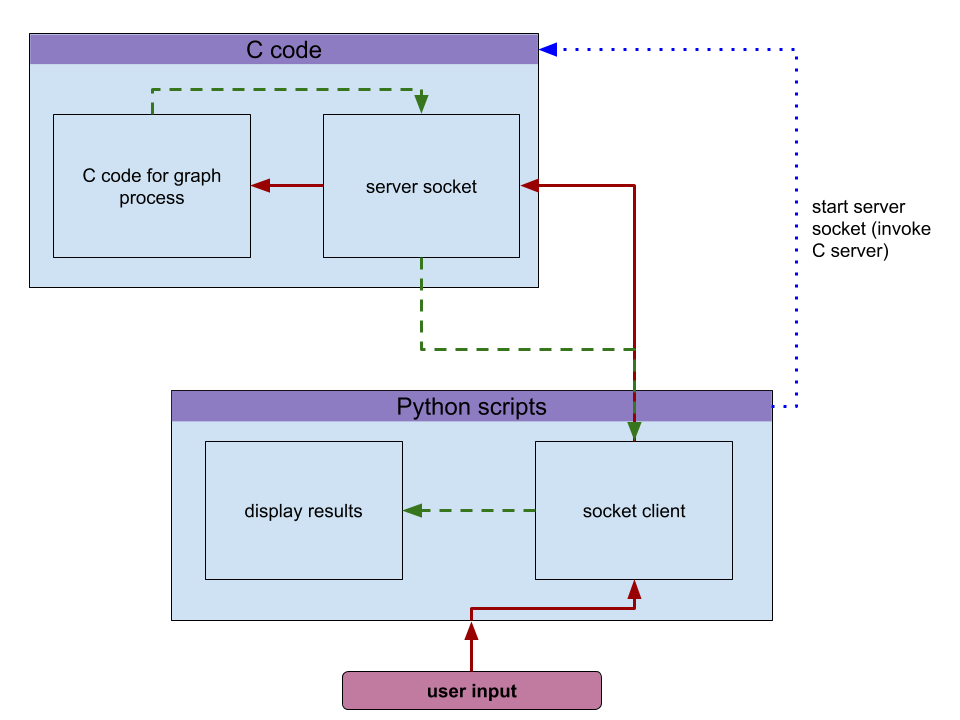

# Creation of random free choice graph generator


# Sommaire
- [Description](#description)
- [Interface](#Interface)
  - [Requires](#Requires)
  - [Commands](#Commands)

# Description <a name="Description"/>

A free choice graph is a subclass of petri net where each place has exactly one output and transitions have one input and multiple outputs as shown on the following figure


# Interface <a name="Interface"/>

All the functions about generating and modifying graph are written in C. But all the display parts are python scripts (because python can use networkx for oriented graph and SNAKES for petri net). Thus, we had to connect C functions with python. So the simplest solution for now is to create a server socket in C that collects python request, process the request and send back the result to python; ctypes was kind of unsatisfying. All the described process can be visualize on the following figure :



  ## Requires <a name="Requires"/>
**Version** : Python 3.5

**Used modules** :
  - ctypes
  - networkx
  - [SNAKES](https://snakes.ibisc.univ-evry.fr/)
  - graphviz (pay attention that you probably will need to install it for python and for the OS)

  ## Commands to use python interface <a name="Commands"/>
The module *SocketCommunication* contains all the needed classes and functions to communicated with the server side. We can underline :

  - *Task* (class) that store all the values for request. Each request start with a specific task that help the server to know which result needed to be send back
  - *Request* (ctypes structure) which is the formated request to send
    - *createRequest* (function) create a new request while formating the arguments into the correct ctypes
  For example, to create a new request use the command ```request = createRequest(task = Task.f_createStronglyConnectedGraph, n=n, D=D)``` with n, D specific arguments
  - *Server* (class) the main class that start the server at the beging and then send the needed request and return the response as string
  For example, to start the server side use ```src=Server(port=5112, buffersize=512)``` or ```src=Server()``` to fill automatically the arguments. Port is the communication port (which can be found automatically if not precised) and buffersize is the size of the buffer use between the clent and the server to transmit data.
  Be aware of the closing of the server : at the end of the script the server need to be closed. For that purpose use the command *srv.close()*
 
The module *GraphDisplay* takes the formated response of the server and convert it into an usable graph. The module contains :
  
  - *ParseGraph* (function) that takes the formated string of the server response and converts it into an iterable object
  The graph is send back as an array of array of child for each node. For example if the array is graph, the graph[0] = [...] contains all the sucessors of the node 0
  - *toNetworkxGraph* (function) convert the graph (following the previous format) into an object usable by the librairy networkx
  - *plotGraph* (function) plot into a figure a networkx graph
  - *createStronglyConnectedGraph* (function) takes two main arguments *n* which is the desired number of nodes and *D* which is the maximun number of sucessors allowed for a node. The other arguments are for the graphical display.
  The function return a n-uplet (figure, graph, networkx graph) where figure is the figure where the networkx graph was plot
  
An example of the use of the functions :
``` 
import SocketCommunication as sc

srv = sc.Server()

res = createStringlyConnectedGraph(n=7,D=3, nodeSize=200, widthArraw=1.5)
f=res[0]
graph = res[1]
networkx_graph = res[2]
f.show()

srv.close()
```

 ### About the tasks value
...later
